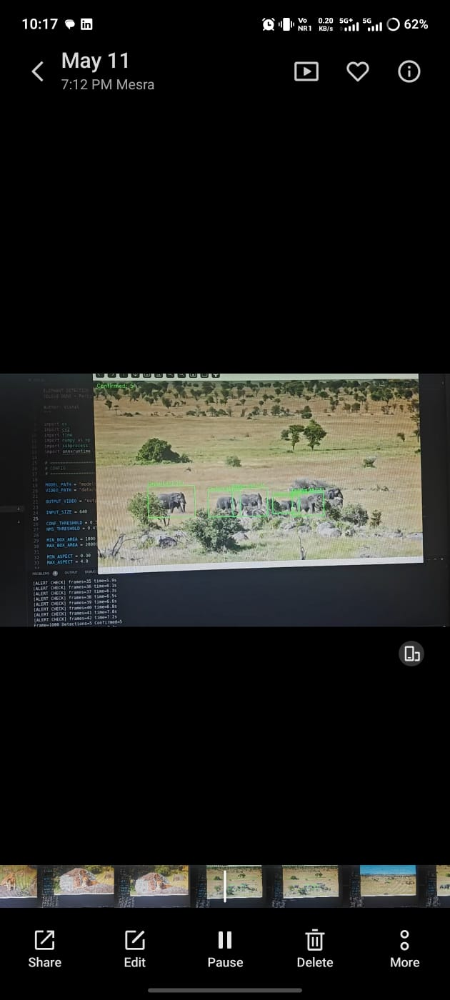
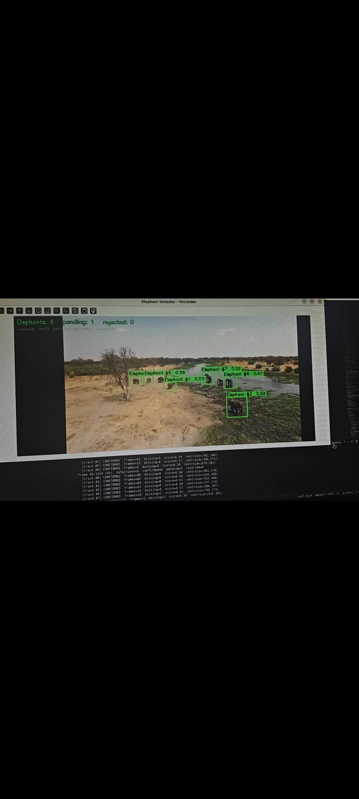

# 🐘 Real-Time Elephant Detection and Alert System

## Overview

Human-Elephant Conflict is a growing concern in many regions where elephants frequently enter villages, farms, and forest boundary areas, causing loss of human life, crop damage, and threats to wildlife conservation.

This project presents an AI-powered Real-Time Elephant Detection and Alert System that uses Computer Vision, Edge AI, GPS Localization, and Cellular Communication to detect elephant intrusions and generate immediate alerts.

The system processes live camera/drone footage, detects elephants using a YOLOv8-based model, determines the target location, and sends alerts to authorities, helping prevent human-elephant conflicts.

---

## Problem Statement

Traditional wildlife monitoring systems rely heavily on:

- Manual forest patrols
- Camera traps
- Human observation

These methods are:

- Labor intensive
- Slow
- Limited in coverage
- Unable to provide real-time alerts

An intelligent automated surveillance system is required for early detection and warning of elephant intrusions.

---

## Objectives

- Achieve accurate real-time elephant detection using AI-based Computer Vision.
- Provide early warning alerts to reduce human and elephant casualties.
- Enable intelligent monitoring of forest boundaries.
- Store detection events with timestamps and location information.
- Support wildlife conservation and human-animal coexistence.

---

## Key Features

✅ Real-time elephant detection

✅ Edge AI deployment using ONNX Runtime

✅ Live image/video processing

✅ Bounding box visualization

✅ Elephant counting

✅ SMS alert generation

✅ GPS-based localization

✅ Drone integration support

✅ Detection event logging

✅ Low-latency deployment on edge devices 

---

## System Architecture

```text
Drone / Camera Feed
          │
          ▼
 Video Compression
          │
          ▼
    YOLOv8 Model
          │
          ▼
 Elephant Detection
          │
          ▼
 Bounding Box & Count of Elephant
          │
          ▼
 GPS Localization
          │
          ▼
 SMS Alert Generation
          │
          ▼
 Forest Authorities / Monitoring Station
```

---

## Technology Stack

### Artificial Intelligence

- YOLOv8
- ONNX Runtime

### Programming Language

- Python

### Computer Vision

- OpenCV
- NumPy

### Edge Computing

- ONNX Inference Engine

### Communication

- GSM Module (Quectel EC25)
- Cellular Communication

### Localization

- GPS
- IMU
- Geo-target Localization

---

## Dataset

### Sources

- Roboflow
- Kaggle
- TensorFlow Datasets
- Existing Annotated Wildlife Datasets

### Dataset Statistics

- 20,000+ Images
- 11,000+ Elephant Images
- Non-elephant classes include:
  - Rhino
  - Bison
  - Buffalo
  - Wild Boar

### Annotation Tool

- Roboflow (Bounding Box Annotation)

---

## Machine Learning Pipeline

1. Dataset Collection
2. Data Cleaning & Annotation
3. YOLOv8 Training
4. Model Validation
5. Export Model (.pt)
6. ONNX Conversion
7. Edge Optimization
8. Real-Time Inference
9. Alert Generation

---

## Project Structure

```text
elephant_detection/
│
├── models/
│   └── best.onnx
│
├── images/
│
├── outputs/
│
├── main.py
├── requirements.txt
├── README.md
└── .gitignore
```

---

## Installation

### Clone Repository

```bash
git clone https://github.com/vishal-kumar2/elephant-detection-system.git
cd elephant-detection-system
```

### Create Virtual Environment

```bash
python -m venv venv
```

### Activate Environment

#### Windows

```bash
venv\Scripts\activate
```

#### Linux/Mac

```bash
source venv/bin/activate
```

### Install Dependencies

```bash
pip install -r requirements.txt
```

---

## Running the System

```bash
python main.py
```

The system will:

- Load the ONNX model
- Process image/video feed
- Detect elephants
- Draw the bounding boxes
- Count detections
- Generate alerts when required

---

## Results

### Detection Result






---

## Applications

- Wildlife Monitoring
- Smart Forest Surveillance
- Human-Elephant Conflict Prevention
- Conservation Research
- Protected Area Monitoring
- Drone-Based Wildlife Tracking

---

## Future Scope

- Live drone deployment
- Flight-controller integration
- Automated siren/buzzer activation
- Cloud-based monitoring dashboard
- Multi-animal detection system
- Mobile application integration
- Advanced GPS tracking and geofencing

---

## Team Members

- Vishal Kumar
- Saurabh Kumar
- Gaurav Gupta

### Under the Supervision of

Dr. Priyank Saxena

Department of Electronics and Communication Engineering

Birla Institute of Technology, Mesra

---

## Acknowledgements

- BIT Mesra
- Roboflow
- Ultralytics YOLO
- OpenCV Community
- ONNX Runtime

---

## License

This project was developed for academic and research purposes as part of the End Semester Minor Project at Birla Institute of Technology, Mesra.
